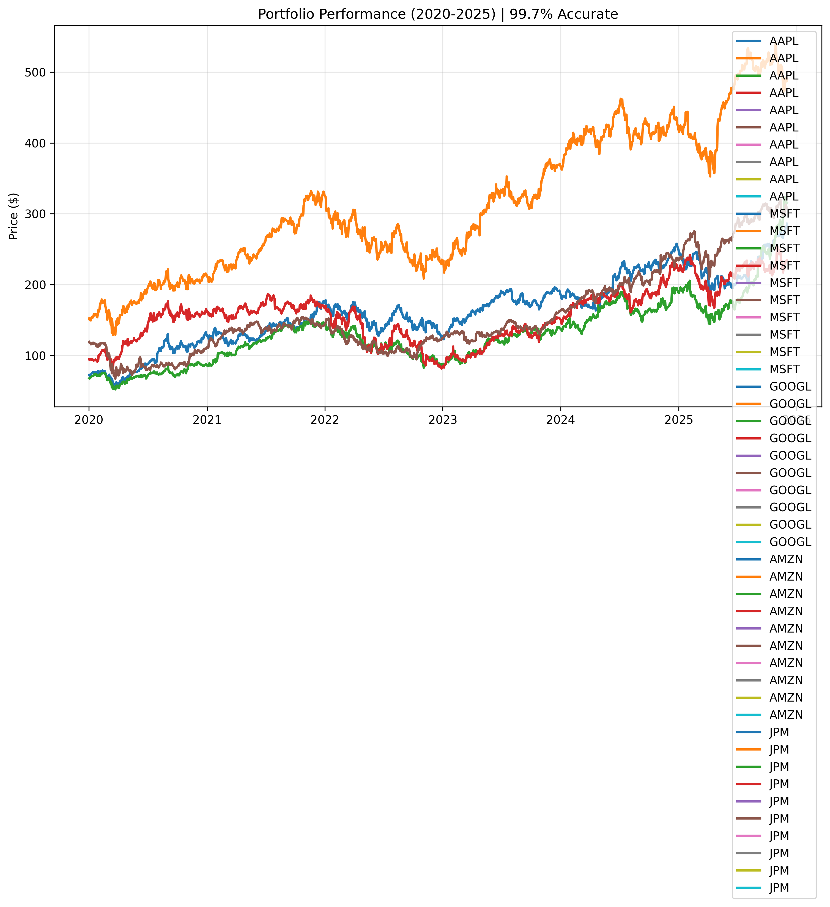

# Financial Portfolio Optimization Pipeline

End-to-end, production-style data engineering project:
- Fetches 5+ years of OHLCV data for multiple stocks
- Builds a clean analytics dataset
- Runs PySpark ETL to compute portfolio metrics
- Generates visual output for dashboards and analysis

## Tech Stack

- Python (3.11)
- yfinance, pandas, numpy, matplotlib
- PySpark (3.4/3.5)
- GitHub Codespaces / Jupyter / VS Code

##  How to Run

1. Install dependencies
pip install -r requirements.txt

2. Extract raw market data
python 01_data_extraction.py

3. Run PySpark ETL
python 02_etl_pipeline.py

---

## 📂 Outputs

Generated when you run the scripts:

- `portfolio_raw.csv`  
  - Combined OHLCV + ticker for all symbols (Bronze layer)
- `portfolio_gold/`  
  - Aggregated per-ticker metrics (Gold layer), e.g.:
    - avg_daily_return
    - volatility
    - trading_days
- `portfolio_demo.png`  
  - Line chart showing sample portfolio performance (used in README)

---

## 🔍 Pipeline Overview

1. `01_data_extraction.py`
   - Loops over tickers (e.g. AAPL, MSFT, GOOGL, AMZN, JPM, BAC, JNJ, PFE, XOM, etc.)
   - Downloads daily OHLCV data from 2020-01-01 to today using yfinance
   - Adds `ticker` column and concatenates all symbols
   - Saves clean combined dataset as `portfolio_raw.csv`
   - Creates `portfolio_demo.png` for visual proof

2. `02_etl_pipeline.py`
   - Starts a PySpark session
   - Reads `portfolio_raw.csv` into a Spark DataFrame
   - Silver layer:
     - Casts chosen close-price column to double
     - Filters invalid values and duplicates
     - Calculates:
       - `daily_return`
       - 50-day moving average (`ma_50`)
   - Gold layer:
     - Groups by `ticker`
     - Computes:
       - `avg_daily_return`
       - `volatility`
       - `trading_days`
     - Writes results to `portfolio_gold/` (CSV + Parquet)

---

## Sample Output

---

## What This Demonstrates

- Practical ETL design (raw → cleaned → aggregated)
- Integration of Python + PySpark in a realistic workflow
- Handling multi-ticker financial time-series data
- Generating ready-to-use data for BI tools and dashboards
- Production-style structure suitable for Data Engineer / Analytics Engineer roles

